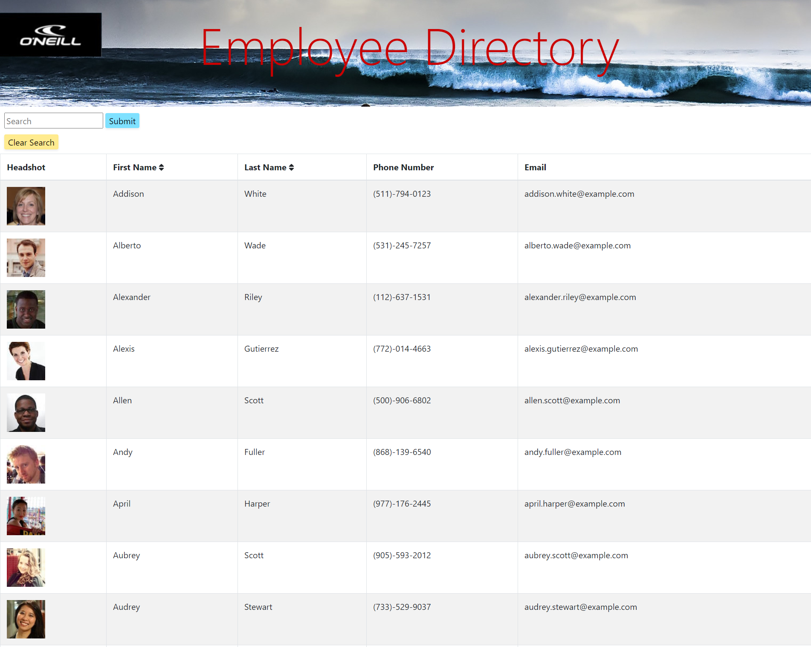

# O'Neill Employee Directory

[LIVE SITE -- O'Neill Employee Directory](https://hidden-reaches-25756.herokuapp.com/)

## Table of Contents
- [Description](#description)
- [Screenshots](#screenshots)
- [Installation](#installation)
- [Usage](#usage)
- [Contributors](#contributors)
- [Testing](#testing)
- [Questions](#questions)
- [License](#license)

---

## Description
Shred the gnar, bruh! We got some awesome employees here at O'Neill and we love to give them time to surf to their hearts desire. We're all friends in the surf community and that's how many of these great people came to work here. But, sometimes we catch too many rays and forget who works with us. So, we put together this tubular directory of all our excellent O'Neill employees!! Built with Reach, we have a searchable and sortable list to find who you're looking for and provide the information you need to contact them. 

---

## Screenshots

---

## Installation
As this program uses a slew of dependencies, you will want to open an integrated terminal in the project folder to make sure those are installed. When cloning the respository, the package.json should already list the dependencies needed. First, you'll need to make sure the dependancies are installed on your maching by typing "npm i" into the terminal. Then, install the node modules by typing "npm i" into the terminal. If those dependancies are not listed in the package.json file, you will want to be sure you have the following dependencies: 
1. "axios"
2. "bootstrap"
3. "react"
4. "react-bootstrap"
5. "react-dom"
6. "react-scripts"
7. "web-vitals"

This application also used Font Awesome dependencies. To install those, follow the instructions on the [Font Awesome Website for React](https://fontawesome.com/how-to-use/on-the-web/using-with/react).

---

## Usage
This is a simple directory that can be revised for a range of needs, not just for sorting through and searching employees. It can be a directory for keeping a list of animals in your zoo, or restaurants you have tried or want to, or National Parks. There is quite a range of how the framework of this applcation can be used. 

---

## Contributors
This project code was largely provided and was improved upon by Adam Horn, with guidance from Ryan Skog and Zac Warner.

---

## Testing
Testing files are not provided but can be done when forking and cloning the repository to your computer.  

---

## Questions
GitHub username: [mradamhorn](https://github.com/mradamhorn)

Email address: mr.amhorn@gmail.com

---

## License
